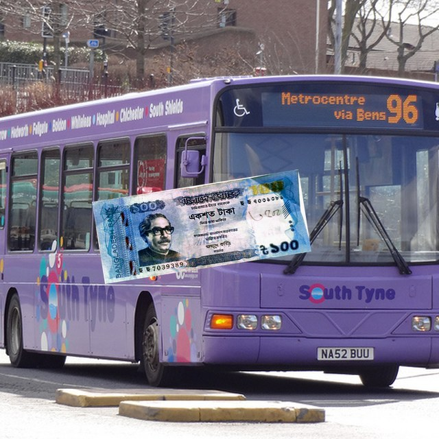

# Wearable Smart Glass for Blind People (OCR + YOLO)

Senior project: an **offline assistive wearable** that reads Bangla/English text, announces everyday objects, and recognises **Bangladeshi Taka** notes with voice feedback.

**GitHub:** [aflam330/Senior_project_wearable_glass_for_blind_people_using_ocr_and_ylo](https://github.com/aflam330/Senior_project_wearable_glass_for_blind_people_using_ocr_and_ylo)

| Mode | What it does |
|------|----------------|
| OCR | Capture text, then speak it (Bangla + English) |
| Object | YOLOv8 everyday-object announcements |
| Currency | Detect BDT denominations (2–1000 Taka) and speak the amount |

<p align="center">
  
  
</p>

<p align="center"><em>Left: sample note from the local dataset. Right: YOLO detection overlay (100 Taka). The full image dataset is not in this repo.</em></p>

---

## Repository layout

| Folder | Role |
|--------|------|
| [`savior_glass/`](savior_glass/) | Raspberry Pi 5 smart-glass app (OCR, object, currency, GPIO, TTS) |
| [`smart-glass/`](smart-glass/) | Same glass codebase (duplicate / rename fork) |
| [`realtime_bangla_taka_detection/`](realtime_bangla_taka_detection/) | YOLOv8 Taka detector, RoboEye modules, trained weights, report |
| [`docs/`](docs/) | Paper outlines and bibliography |
| [`CURR/files/`](CURR/files/) | Currency-detection paper draft + figures |
| [`ieee_figures_download/`](ieee_figures_download/) | IEEE paper figures (PNG) |
| [`samples/`](samples/) | Two example photos only (not the full dataset) |

---

## What is **not** uploaded

The training datasets are large (hundreds of thousands of images) and stay on the local machine under `data set/`:

- BanglaTaka / paper-currency photos
- JaalTaka authenticity views
- COCO backgrounds
- Generated YOLO composites (`currency_yolo_data`)

To rebuild the detector, see [`realtime_bangla_taka_detection/README.md`](realtime_bangla_taka_detection/README.md) (Mendeley BanglaTaka + COCO backgrounds).

Trained **weights are included** in `realtime_bangla_taka_detection/models/` (`best.pt`, ONNX, TorchScript, authenticity heads).

---

## Quick start

### Live Taka detector (Windows)

```powershell
cd realtime_bangla_taka_detection
python -m venv venv
.\venv\Scripts\pip.exe install -r requirements.txt
.\venv\Scripts\python.exe scripts\realtime_detect.py
```

- `SPACE` — speak the detected note  
- `q` — quit  

Full RoboEye HUD (authenticity, FER, Grad-CAM, voice):

```powershell
.\venv\Scripts\python.exe scripts\roboeye_live.py
```

### Smart glass (Raspberry Pi 5)

See [`savior_glass/README.md`](savior_glass/README.md) and `savior_glass/install.sh`. Windows harness:

```powershell
cd savior_glass
python test_windows.py
```

---

## Docs

- [Project overview](docs/00_OVERVIEW.md)
- [Currency detection paper notes](docs/PAPER1_Currency_Detection.md)
- [Smart-glass system paper notes](docs/PAPER2_Smart_Glass_System.md)
- [Feature audit](FEATURE_AUDIT_REPORT.md)
- [Currency report PDF](realtime_bangla_taka_detection/Bangla_Currency_Detection_Report.pdf)
