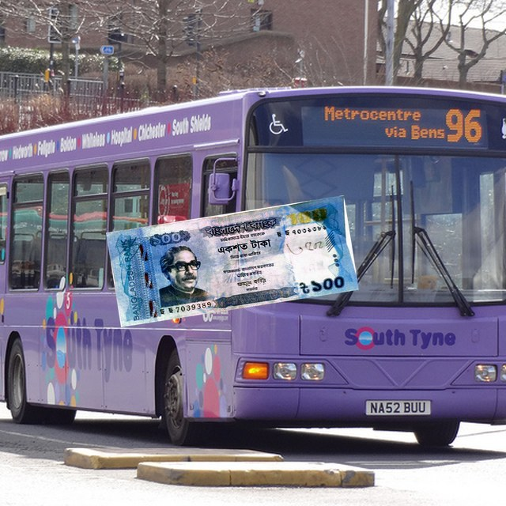

# Wearable Smart Glass for Blind People (OCR + YOLO)

Senior project: an **offline assistive wearable** that reads Bangla/English text, announces everyday objects, and recognises **Bangladeshi Taka** notes with voice feedback.

**GitHub:** [aflam330/Senior_project_wearable_glass_for_blind_people_using_ocr_and_ylo](https://github.com/aflam330/Senior_project_wearable_glass_for_blind_people_using_ocr_and_ylo)

| Mode | What it does |
|------|----------------|
| OCR | Capture text, then speak it (Bangla + English) |
| Object | YOLOv8 everyday-object announcements |
| Currency | Detect BDT denominations (2–1000 Taka) and speak the amount |

<p align="center">
  
  
</p>

<p align="center"><em>Left: sample note from the local dataset. Right: YOLO detection overlay (100 Taka). The full image dataset is not in this repo.</em></p>

---

## Project structure

```
Final SP/
├── realtime_bangla_taka_detection/  Taka detector + authentication research (Python package root)
│   ├── roboeye/            library code: authenticity models, Q-DUIG, CAMVA, emotion, pose, haptics, speech
│   ├── models/             trained weights (best.pt / ONNX / INT8, authenticity heads) + novel-algorithm modules
│   ├── configs/            experiment YAML configs
│   ├── data/               YOLO data.yaml (points at data set/currency_yolo_data)
│   ├── scripts/            entry points; scripts/train/ and scripts/eval/ hold the research runs
│   ├── results/            saved metrics, predictions and checkpoints behind every reported number
│   └── requirements.txt    (venv/, cache/ and runs/ are local and git-ignored)
├── savior_glass/          Raspberry Pi 5 smart-glass app
│   ├── main.py             Pi entry point (GPIO buttons, camera, speech)
│   ├── test_windows.py     desktop harness (keyboard instead of buttons)
│   ├── modes/              OCR, object, currency (+ jaal check), online Claude mode
│   ├── assistive/          emotion and pose, imported from realtime_bangla_taka_detection/roboeye
│   ├── scripts/            training, evaluation, Pi benchmark and hardware-logic tests
│   └── models/, assets/, results/
├── paper_evidence/        research write-ups, tables, figures and CLAIM_REGISTRY.json (every claim → source file)
├── docs/                  project documentation
│   ├── 00_OVERVIEW.md, PAPER1_*, PAPER2_*, RELATED_WORK_BIBLIOGRAPHY.md
│   ├── reports/            feature audit, dated progress report and its generator
│   ├── papers/currency_detection/  currency-detection paper draft (LaTeX + figures)
│   ├── figures/ieee/       IEEE figures (written by scripts/generate_ieee_figures.py)
│   └── literature/         source spreadsheet of reviewed papers
├── Thesis Report and paper/  thesis LaTeX sources and figures
├── samples/               two example images shown in this README
├── data set/              training/eval datasets, local only (git-ignored)
├── data set for comparison/  external Taka + ModelNet40 datasets, local only (git-ignored)
├── Unused/                retired or superseded files kept for reference (see Unused/README.md); nothing is loaded from here
├── run_research_pipeline.py  wrapper for realtime_bangla_taka_detection/run_research_pipeline.py
└── setup.py, LICENSE, CITATION.cff, CONTRIBUTING.md
```

The two application folders, `paper_evidence/` and the dataset folders keep their names because code,
saved results and the claim registry refer to them by path.

---

## What is **not** uploaded

The training datasets are large (hundreds of thousands of images) and stay on the local machine under `data set/`:

- BanglaTaka / paper-currency photos
- JaalTaka authenticity views
- COCO backgrounds
- Generated YOLO composites (`currency_yolo_data`)

To rebuild the detector, see [`realtime_bangla_taka_detection/README.md`](realtime_bangla_taka_detection/README.md) (Mendeley BanglaTaka + COCO backgrounds).

Trained **weights are included** in `realtime_bangla_taka_detection/models/` (`best.pt`, ONNX, TorchScript, authenticity heads).

---

## Quick start

### Live Taka detector (Windows)

```powershell
cd realtime_bangla_taka_detection
python -m venv venv
.\venv\Scripts\pip.exe install -r requirements.txt
.\venv\Scripts\python.exe scripts\realtime_detect.py
```

- `SPACE` — speak the detected note  
- `q` — quit  

Full RoboEye HUD (authenticity, FER, Grad-CAM, voice):

```powershell
.\venv\Scripts\python.exe scripts\roboeye_live.py
```

### Smart glass (Raspberry Pi 5)

See [`savior_glass/README.md`](savior_glass/README.md) and `savior_glass/install.sh`. Windows harness:

```powershell
cd savior_glass
python test_windows.py
```

---

## Docs

- [Project overview](docs/00_OVERVIEW.md)
- [Currency detection paper notes](docs/PAPER1_Currency_Detection.md)
- [Smart-glass system paper notes](docs/PAPER2_Smart_Glass_System.md)
- [Feature audit](docs/reports/FEATURE_AUDIT_REPORT.md)
- [Currency report PDF](realtime_bangla_taka_detection/Bangla_Currency_Detection_Report.pdf)
